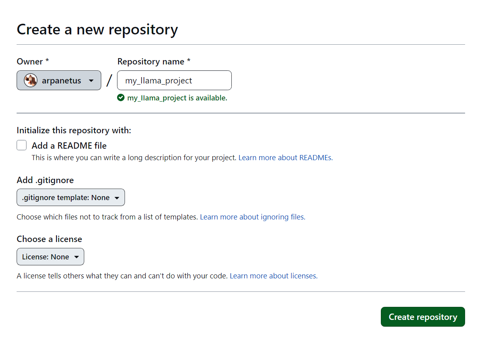
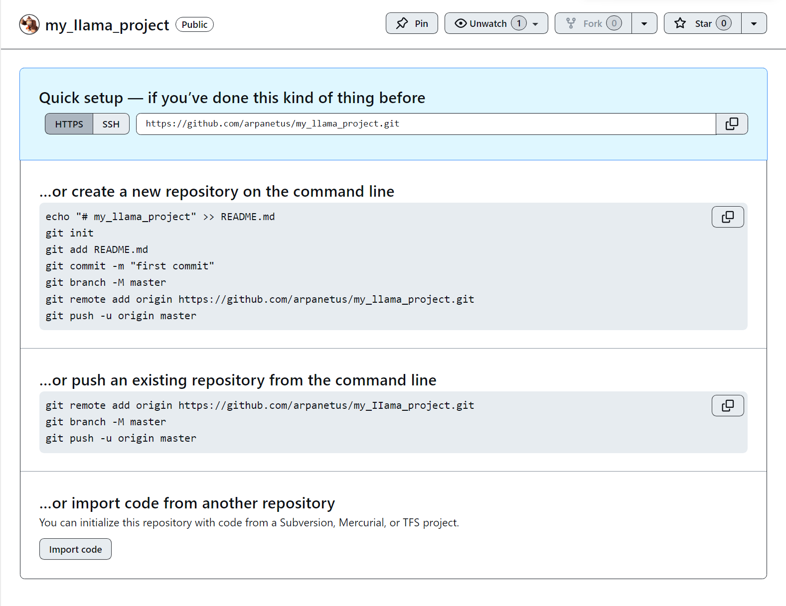
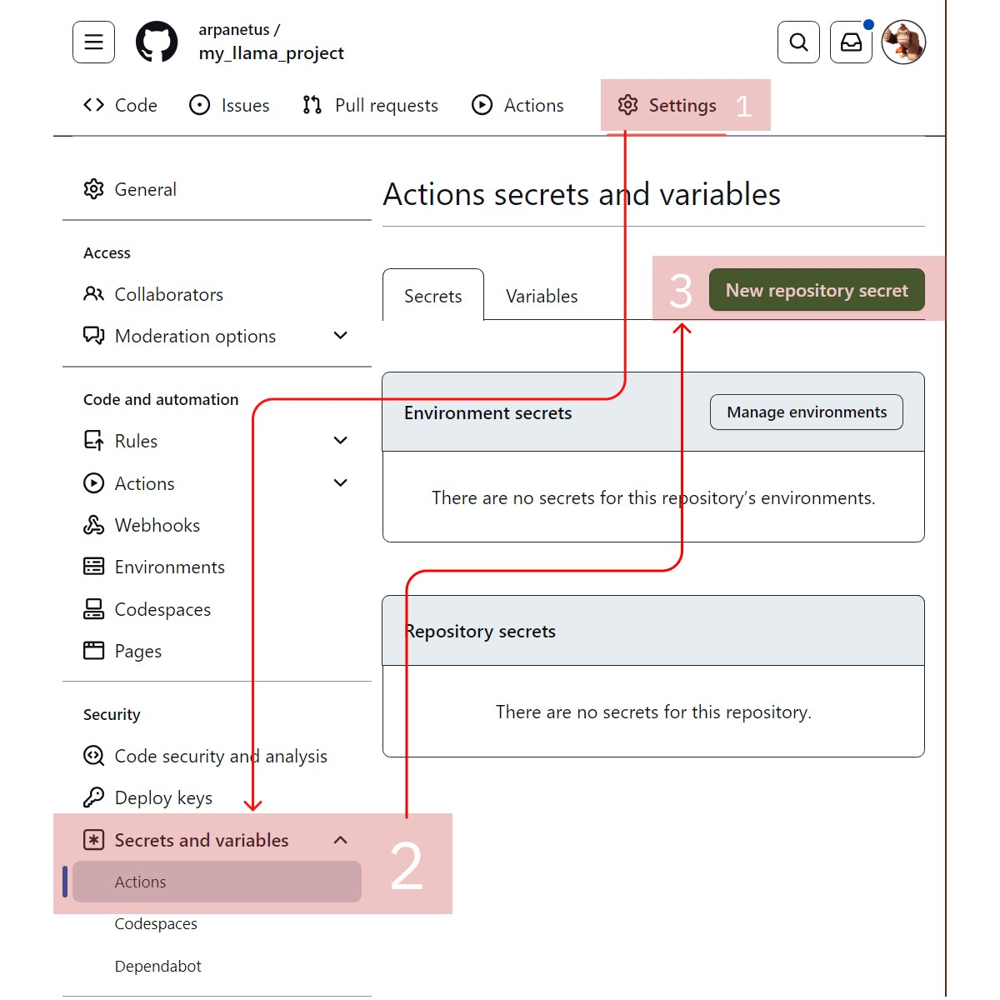
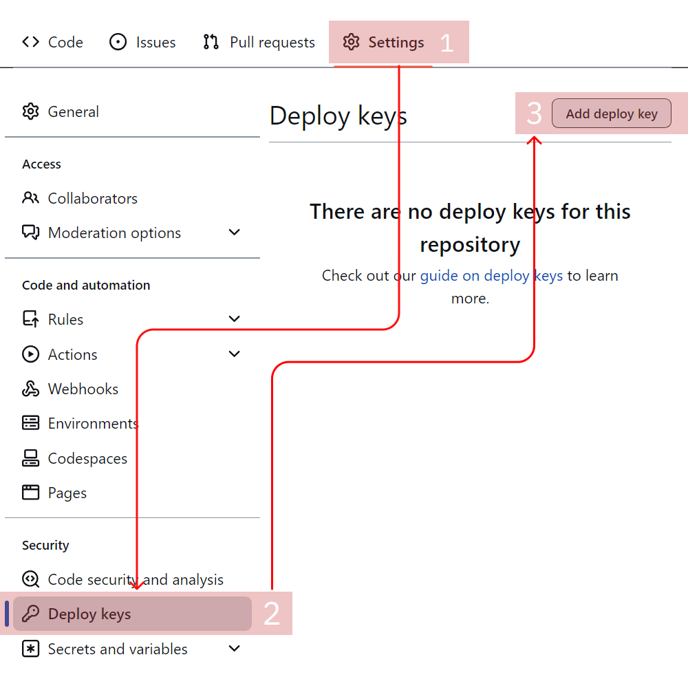
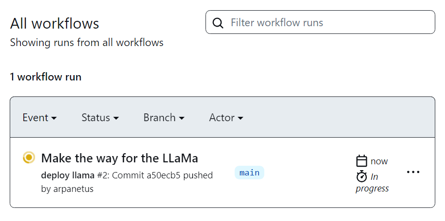
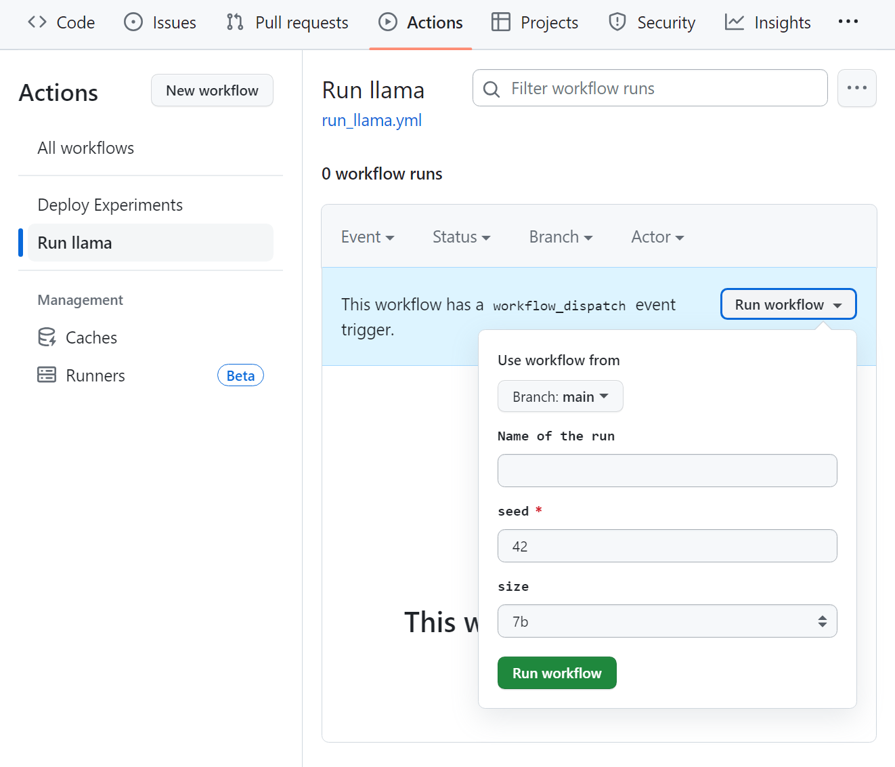
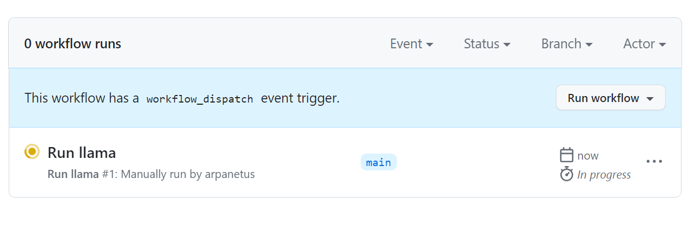
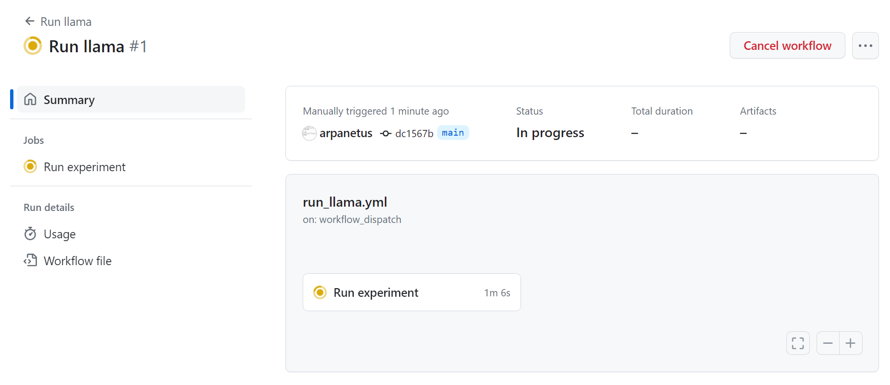
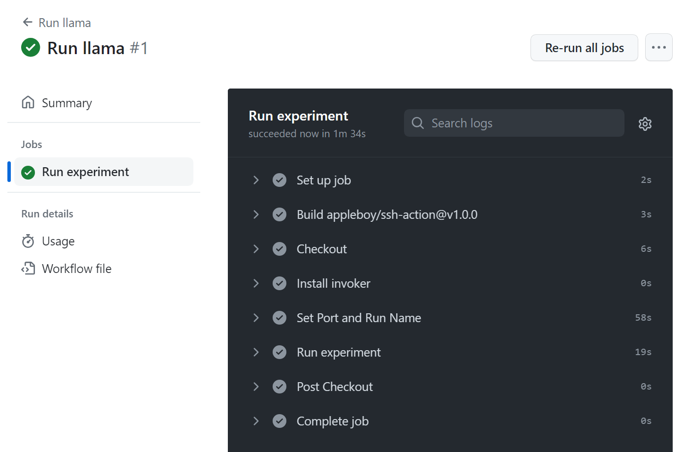

## Setup tutorial

<blockquote> <i><p style="margin-right: 0;"><big>"Simplicity is prerequisite for reliability."</big></p> <footer> — Edsger W. Dijkstra</footer></i> </blockquote>

## Initialize the project

```bash
$ higgsfield init my_llama_project
```

 <details> <summary>It creates a folder named <code>my_llama_project</code> with the following structure: </summary>

```
my_llama_project
├── src 
│   ├── __init__.py
│   ├── experiment.py
│   └── config.py
├── Dockerfile
├── env
├── requirements.txt
└── README.md
```
</details>

## Setup the environment
Get into the project folder:
```bash
$ cd my_llama_project
```
Then start editing the `env` file. It should contain the valid SSH key to your training nodes. Make sure the key exists under the given path in your machine.
For example:

```bash
$ cat env
SSH_KEY=~/.ssh/id_rsa
```
Great! Now you should edit the `src/config.py` file. It contains your experiments' configuration. <details>
<summary>Example</summary>

```python
import os

NAME = "my_llama_project"

# You should fill this place with your training nodes IPs
HOSTS = [
    "1.2.3.4", 
]

# The user name of your training nodes, 
# It should be the same for all nodes.
# And it might be different than 'ubuntu'.
HOSTS_USER = "ubuntu" 

# The port of your training nodes, same for all nodes.
HOSTS_PORT = 22

# Number of processes per node. Depends on the amount of GPUs you have on each node.
NUM_PROCESSES = 4

# You can list other environment variables here.
WAN_DB_TOKEN = os.environ.get("WAN_DB_TOKEN", None)
```
You should fill those fields with your own configuration.
</details>

## Setup git

You should create [a new git repository](https://github.com/new) in Github. Make sure you won't create any `README`, `.gitignore` or `LICENSE` files. 
<details>
<summary>Just an empty repository.</summary>



</details>


Then follow the first option in the Github page to push an existing repository from your terminal.

<details>
<summary>Details screen.</summary>



</details>

## Time to setup your nodes!

Now you should setup your nodes. You can do it running:
```bash
$ higgsfield setup-nodes
```
Which will install all the required tools on your nodes. You might need some patience here, don't worry, it's a one time process. Like this:
```
$ higgsfield setup-nodes
INSTALLING DOCKER
...
INSTALLING INVOKER
...
SETTING UP DEPLOY KEY
...
PULLING DOCKER IMAGE
```


<details>
<summary>But if you're stuck...</summary>


But if you're stuck for some reason on this step, because you haven't added your git origin, then you should try to toggle between `SSH | HTTPS` options on top of Github page. Then try to run the `git remote add origin` command again.
If it's not because of that, then you should try to properly setup your SSH key in `env` file along with the config file in `src/config.py`.


</details>


## Run your very first experiment

You're very close to run your first experiment. Take a look at the `src/experiment.py`.
```python
@experiment("llama")
@param("size", options=["70b", "13b", "7b"])
def train_llama(params):
    print(f"Training llama with size {params.size}")
    ...
```
That's exactly the way you will be defining experiments further on. No need for `hydra`,  `argparse` or any other boilerplate code. Just define your experiment, then run the following command:
```bash
$ higgsfield build-experiments
```

Notice anything new? It's a new folder named `.github/workflows` with the following structure:
```
.github
└── workflows
    ├── run_llama.yml
    └── deploy.yml
```
<details>
<summary>Curious about them?</summary>
These files were exactly intended to be your entrypoint to the simplified deploy of your experiments. Now you can just push your code to Github, and it will automatically deploy the code on your nodes. Not only that, it will also allow you to run your training experiments and save the checkpoints!
</details>


### Fasten your seatbelt, it's time to deploy!
You should add your `SSH_KEY` contents into Github secrets. To achieve that you should go to your Github repository page, then click on `Settings` tab, then `Secrets` tab, then `New repository secret` button. Then add your `SSH_KEY` contents as a secret with the name `SSH_KEY`. 

<details>
<summary> Like this. </summary>



</details>

And add your deploy key into deploy keys. You can get it by running the following command:
```bash
$ higgsfield show-deploy-key
ssh-ed25519 AAAAC3NzaC1lZDI1NTE5A000THERESHOULDBEYOURDEPLOYKEYHEREso83os//

```
Copy the output and add it. You can name it `DEPLOY_KEY`.
<details>
<summary> Like this. </summary>



</details>


Push your code:
```bash
git add .
git commit -m "Make the way for the LLAMA!"
git push origin main
```

Now you should go to the `Actions` tab in your Github repository page. You should see something like this:



As soon as it turns green (which means it's done), you can go to the left side and run the `run_llama.yml` workflow, put any name you like, and click `Run workflow` button:


Run is running...



And finished running! Experiment is training on your nodes!

